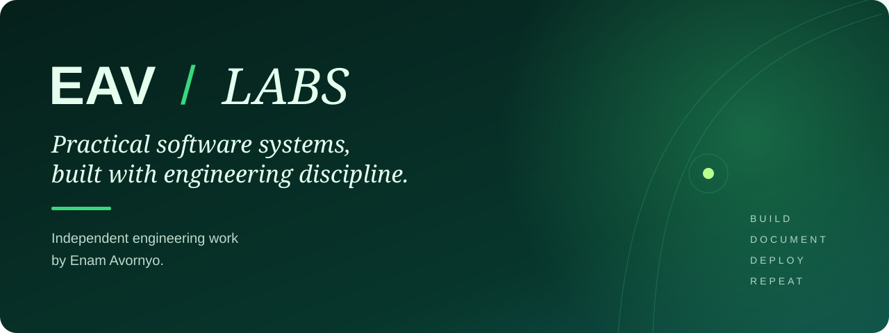

  

  <strong>Web · Mobile · Backend · APIs · Cloud · Automation</strong>

## Independent engineering work

**EAV Labs** is the personal engineering lab of [Enam Avornyo](https://github.com/enamavornyo), a full-stack software engineer building practical software across web, mobile, backend, and cloud-ready systems.

The projects here are built around real operational problems and treated as software products: designed deliberately, implemented cleanly, tested, documented, containerized where useful, and prepared for deployment.

## Featured systems

| | System | Focus | Stack |
| --- | --- | --- | --- |
| **01** | [**EAV Insight**](https://github.com/eav-labs-dev/eav-insight-api) | Document intake, operational reporting, searchable business records | FastAPI · PostgreSQL · Docker |
| **02** | [**EAV Field**](https://github.com/eav-labs-dev/eav-field-mobile) | Offline-first field inspections, evidence capture, synchronization | React Native · Expo · TypeScript |
| **03** | [**EAV Dispatch**](https://github.com/eav-labs-dev/eav-dispatch-service) | Logistics, assignments, shipment lifecycles, audit history | Java · Spring Boot · PostgreSQL |
| **04** | [**EAV Ledger**](https://github.com/eav-labs-dev/eav-ledger-api) | Billing, invoices, payments, and business workflows | PHP · Laravel · PostgreSQL |

## Engineering approach

The emphasis is on practical product engineering rather than isolated code samples: clear API contracts, maintainable architecture, useful interfaces, automated testing, CI/CD, Dockerized development, deployment readiness, and documentation that explains both the system and the decisions behind it.

EAV Labs also gives me room to work across different parts of the stack. Some projects go deep on API and service design; others focus on mobile workflows or business processes. Together, they represent how I approach full-stack engineering: understand the workflow, design the system, build it, verify it, and make it usable.

---

  <strong>EAV / LABS</strong> 
  Practical software systems, built with engineering discipline.  
  <a href="https://github.com/enamavornyo">Enam Avornyo</a> · Full-stack Software Engineer

